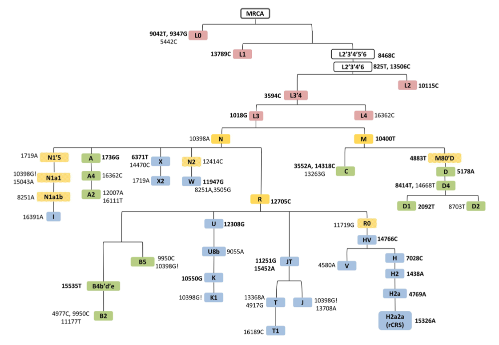
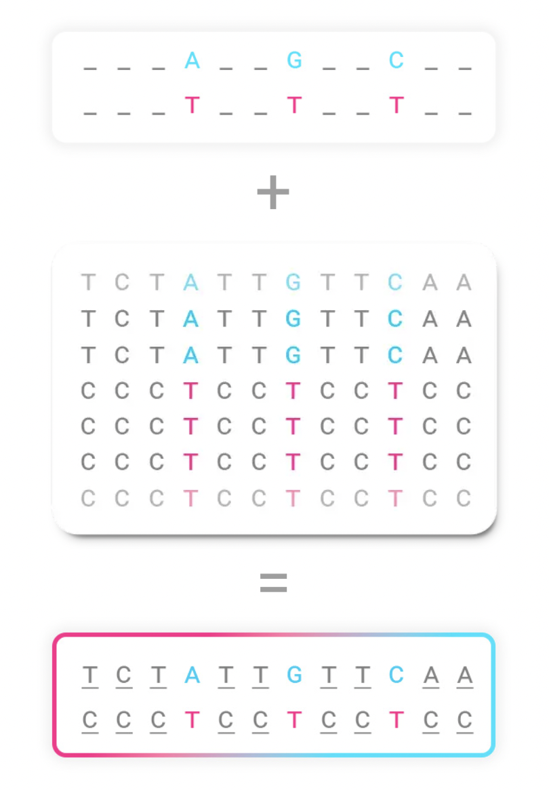

# Motivation

* To apply Artificial Inteligence, Machine Learning, Data Science and Bioinformatics algorithms to genomic information from samples of Brazilian ancestry available in public databases and data banks to calculate risk, phenotype, diagnostic and prognostic probabilities of disease. 

* To build a tool called Gerenciamento Genômico e Algorítmico de Dados de Doenças (Geraldo) for utilization by the public with DATASUS and Programa Genomas Brasil (GenBR).

# 1. Introduction

## 1.1. Mitochondrial genome and matrilinear information

* Mitochondria is an organelle that contains the martrilineal genetic information.

* Mitochondrial genome is 16569 bp long (Bolze 2021) @Bolze2021

{width=60%}

## 1.2. Mitochondrial haplogroups

* Genetic variants (mutations) in mitochondrial DNA can be organized in haplogroups.

* Each matrilineal ancestry has characteristic haplogroups.

* This figure from Mitchell et al., 2014 shows the phylogenetic tree of mitochondrial haplogroups in a large population of the USA.


{width=60%}

## 1.3. Download of mitochondrial sequences

* Sequences of mitochondrion from Brazilians were downloaded from GenBank.

* The code to download such sequences are in the link below.

[Download of mitochondrial sequences.](https://paei.netlify.app/download_sequences)

# 2. Computational Imputation and Databases

* A review on genotype imputation was writen by @Li2009. They even mention using the HapMap project as panels for genotype inference. They do not mention an imputation workflow or protocol for genetic variants of Brazilians. An imputation workflow was provided by @Pärn.

* I was able to find an R function for imputation in https://search.r-project.org/CRAN/refmans/dotgen/html/imp.html

* The function above is in package https://cran.r-project.org/web/packages/dotgen/index.html

* This is a test.

{width=50%}

# 3. Alignment

## Load multi-fasta mtDNA file

Load package msa: multiple sequence alignment

```{r, warning=F, message=F}
library("msa")
```

Load multi-fasta mtDNA from Brazil.

```{r}
mt_brazilian <- readDNAStringSet(file="./data/mt_brazilian.fasta")
```

## Subset from positions 1bp to 302bp

Information about subsetting strings was gained from Chapter 4: Manipulating Sequences with Biostrings, found in @Gatto4. 

```{r}
seq_start_to_end <- subseq(mt_brazilian, start = 100, end = 200)
```

Print sequence

```{r}
print(seq_start_to_end)
```

Align sequences

```{r}
start_time <- Sys.time()
alignment_start_to_end <- msa(seq_start_to_end)
end_time <- Sys.time()
end_time - start_time
alignment_start_to_end
```


# 3. Alignment Visualization

### Load library

* Visualization of the Spike Protein Region alignment was made possible with library ggmsa and the work of @Zhou.

```{r}
library(ggmsa)
```

### Visualization with sample names

* Plot alignment at around position 23063bp, showing variant N501Y

```{r}
ggmsa(mt_brazilian, 
      start = 40, end = 80, 
      char_width = 0.5, 
      seq_name = T) + geom_seqlogo() + geom_msaBar()
```

### Visualization without sample names
 
* Plot without sequence names
 
```{r}
ggmsa(mt_brazilian, 
      start = 40, end = 80, 
      char_width = 0.5, 
      seq_name = F) + geom_seqlogo() + geom_msaBar()
```

# 5. Visualize Haplogroup Classification with Haplogrep 3

Visualization is available https://haplogrep.readthedocs.io/en/latest/annotations/#clusters-and-population-frequencies

[Haplogroup Classification with Haplogrep 3](/Users/gepolianochaves/Desktop/Gepoliano/DNA do Brasil/matrilineal sequences/data/haplogroups 6 eur/haplogroups.html)

# 6. Distance Matrix and Phylogenetic Tree of Partial Sequence

This is necessary so function dist.ml can take the DNA.bin object and
process the Distance Matrix.
Function dist.ml() is from package phangorn

```{r}
library("phangorn")
dm_extremo_sul_msa_partial <- dist.ml(as.DNAbin(alignment_start_to_end))
```

## Plot distance matrix

Function table.paint() is from package adegenet. Load library adegenet:

```{r, eval=T}
library("adegenet")
dm_extremo_sul_msa_partial_df <- as.data.frame(as.matrix(dm_extremo_sul_msa_partial))
table.paint(dm_extremo_sul_msa_partial_df, cleg=0, clabel.row=.5, clabel.col=.5)
```

## Construct Phylogenetic Trees

Phylogenetic tree UPGMA method

```{r}
treeUPGMA_extremo_sul_partial <- upgma(dm_extremo_sul_msa_partial_df)
```

## Plot Phylogenetic Trees Extremo Sul

Plot UPGMA Extremo Sul

```{r}
plot(treeUPGMA_extremo_sul_partial, main="UPGMA", col="red")
```

## 7. References

<div id="refs"></div>

