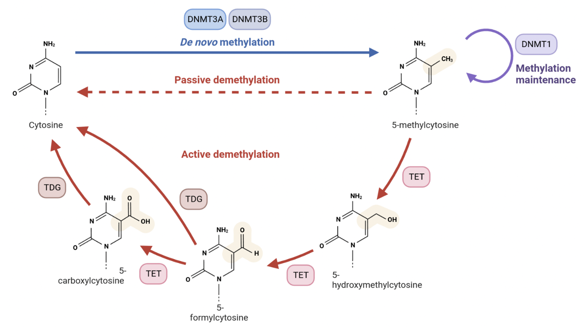
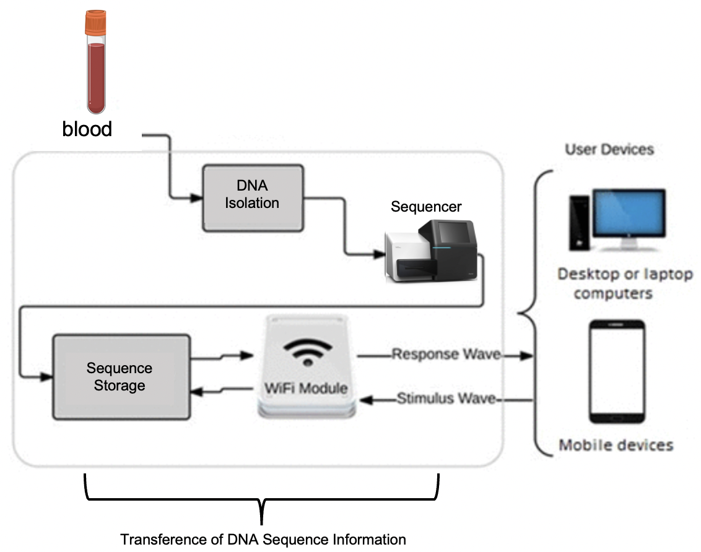

### Epigenética de cânceres pediátricos

Tumores adultos e tumores de crianças não apresentam mecanismos iguais de malignidade e progressão. Enquanto tumores adultos são caracterizados por mutações que acumularam-se durante a vida do paciente, tumores pediátricos parecem ser dirigidos por mecanismos epigenéticos. Modificações epigenéticas são modificações quimicamente adicionadas ao nucleotídeo de DNA, como a metilação, que não afetam a sequência de DNA em si, em contraste com as mutações genéticas dos tumores adultos. O grupo de pesquisa ao qual está ligado o Dr. Gepoliano Chaves, na Universidade de Chicago, desenvolveu e patenteou um método para identificação de perfis epigenéticos de 5-hmC em neuroblastoma, um câncer pediátrico do sistema nervoso periférico. Trata-se do marcador 5-hidroxi-metil-citosina (5-hmC), que pode ser isolado a partir de DNA circulante no sangue de crianças portadoras ou sob investigação de serem acometidas pelo neuroblastoma.

{width=60%}

### PmD para a educação, CT&I e genômica brasileiras

A natureza do trabalho desenvolvido por pesquisadores e profissionais das ciências ômicas envolve o componente computacional. Desta forma, a interação entre pesquisadores e o desenvolvimento de algoritmos computacionais para investigação da atividade dos biomarcadores são procedimentos feitos remotamente. Assim, pesquisadores das ciências ômicas utilizam a computação em nuvem e computação quântica para criar e entregar serviços como oportunidades na pesquisa à distância.

{width=60%}

### Iniciativas

* [Artigos](artigos.html)
* [Código](codigo.html)