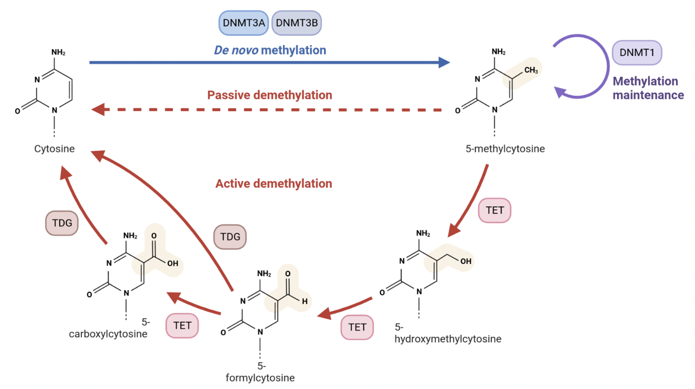

#### Experiência prévia

Baseado nos trabalhos do Dr. Raja GuhaThakurta para estabelecer o Science Internship Program (SIP), e do Dr. Gepoliano Chaves como mentor do mesmo, buscamos desenvolver plataforma para benefício da Educação, Ciência e Tecnologia brasileiras por meio de permitir o acesso à pesquisa real na modalidade à distância às diversas camadas da sociedade brasileira. [Veja a definição do Dr. GuhaThakurta de pesquisa real.](https://www.youtube.com/watch?v=Z0WTzVNB2g4). Como filosofia do Dr. Raja GuhaThakurta para o SIP, pesquisa real é a pesquisa que visa contribuir para o avanço científico na fronteira do conhecimento. [Clique para mais informações sobre práticas de educação à distância](https://www.viterbo.edu/online-teaching/expectations-and-best-practices-online-instructors#:~:text=Instructors%20should%20provide%20meaningful%20feedback,(and%20want)%20more%20specifics.).

#### Exemplificando o conceito de Pesquisa Real à Distância

##### Epigenética de cânceres pediátricos

Tumores adultos e tumores de crianças não apresentam mecanismos iguais de malignidade e progressão. Enquanto tumores adultos são caracterizados por mutações que acumularam-se durante a vida do paciente, tumores pediátricos parecem ser dirigidos por mecanismos epigenéticos. Modificações epigenéticas são modificações quimicamente adicionadas ao nucleotídeo de DNA, como a metilação, que não afetam a sequência de DNA em si, em contraste com as mutações genéticas dos tumores adultos. O grupo de pesquisa ao qual está ligado o Dr. Gepoliano Chaves, na Universidade de Chicago, desenvolveu e patenteou um método para identificação de perfis epigenéticos de 5-hmC em neuroblastoma, um câncer pediátrico do sistema nervoso periférico. Trata-se do marcador 5-hidroxi-metil-citosina (5-hmC), que pode ser isolado a partir de DNA circulante no sangue de crianças portadoras ou sob investigação de serem acometidas pelo neuroblastoma.

{width=60%}

##### Pesquisa real à distância nas ciências ômicas

A natureza do trabalho desenvolvido por pesquisadores e profissionais das ciências ômicas envolve o componente computacional, por definição. O fundador do Instituto de Genômica da UCSC, Dr. David Haussler, tem Ph.D. em ciências da computação. Assim sendo, a interação entre pesquisadores, o desenvolvimento das tecnologias e algoritmos para análise e investigação da atividade dos biomarcadores são procedimentos feitos à distância ou remotamente. Desta forma, pesquisadores das ciências ômicas utilizam a internet, satélites, computação em nuvem e computação quântica para criar e entregar serviços como oportunidades de soluções por meio da pesquisa real à distância.

{width=60%}

#### PmD no *Science Internship Program* (SIP)

* O SIP adotou a PmD durante a pandemia de SARS-CoV-2 a partir de 2020. 

* Há práticas para a educação à distância que permitem maior eficiência no processo de implementação da PmD. 
  - [Métodos de pesquisa na Educação à Distância](https://www.aritzhaupt.com/distance_education/research-methods/)

#### PmD no *Treehouse Undergraduate Bioinformatics Internship* (TUBI)

Programa do Instituto de Genômica da UCSC, desenvolvido pelo laboratório da Dra. Olena Vaske, visando contribuir para o progresso da genômica de cânceres pediátricos.

#### PmD no PAEI

* O PAEI nasce como uma implementação da PmD como consequência do caráter tecnológico das ciências genômicas no que se refere às linguagens de programação computacional.

* Para tanto, mentores, empreendedores e estudantes colaboram no desenvolvimento e compartilhamento de código-fonte.

* Instruções para o compartilhamento de código-fonte podem ser encontradas no seguinte *link*: 
  -  [Compartilhamento de código fonte (OneDrive)](https://tinyurl.com/gitCorndel)
  -  [Compartilhamento de código fonte (Google drive)](https://drive.google.com/file/d/1ouj3EQbKzh60pYNbqeOxHkJKJAa4BnwW/view?usp=sharing)

#### PmD no Brasil

A pesquisa na modalidade à distância é objeto de investimentos da Coordenação de Aperfeiçoamento de Pessoal de Nível Superior (CAPES). A diretoria responsável é a Diretoria de Educação à Distância (DED).
https://www.youtube.com/watch?v=5mjVZ_oLczo&t=2s

Em trabalhos como "*Leading the e-Learning Transformation of Higher Education [OP]: Meeting the Challenges of Technology and Distance Education*", do Dr. Lawrence Ragan, pode-se entender como liderar o progresso na pesquisa e ciência no nível superior para impactar positivamente a educação, ciência e tecnologia brasileiras.