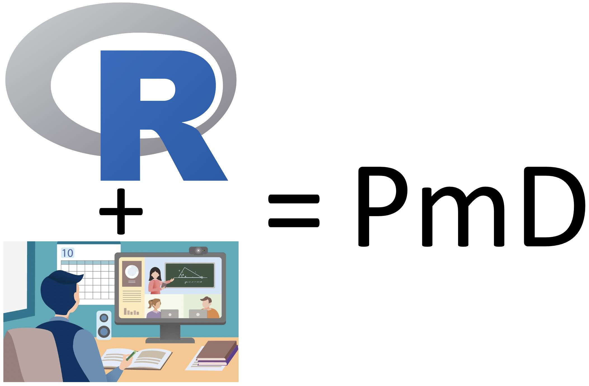
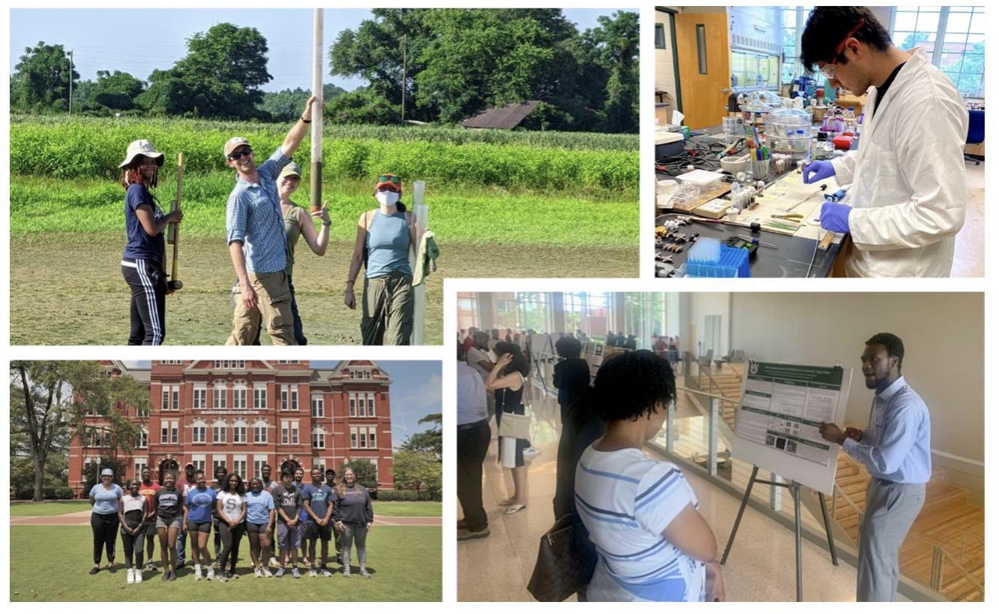

\

\

### Conceitos e Vivências

\

\

O *Science Internship Program* (SIP), trabalha a profissionalização acadêmica permitindo o contato de jovens com ciência e pesquisa. Baseado na atuação do Dr. Gepoliano Chaves no SIP, o PAEI disponibiliza a [pesquisa real na modalidade à distância](https://www.youtube.com/watch?v=Z0WTzVNB2g4) para a Educação, Ciência e Tecnologia brasileiras. A pesquisa real na modalidade à distância (PmD) visa contribuir para o avanço científico na fronteira do conhecimento.

\

\

\

{width=70% style="display: block; margin: 0 auto"}

\

\

\

Diferente da pesquisa real regular acadêmica, a PmD apresentada pelo PAEI não necessita contato presencial e físico entre os participantes, pois os experimentos científicos são fundamentados nas linguagens de programação computacional, como R, Bash e Python. Participantes do PAEI são expostos à PmD por meio das Experiências de Pesquisa para Estudantes (EPEs) detalhadas abaixo.

\

\

### Experiências de Pesquisa para Estudantes (EPEs)

\

\

As experiências de pesquisa para estudantes permitem exploração acadêmica e profissional que desenvolvem vivência de carreiras, pesquisa e ciência para jovens estudantes. Embora muitas EPEs ocorram de forma física e presencial, outras, devido à natureza essecialmente computacional, como a bioinformática e a genômica, podem ser executadas de formas totalmente remotas e *on-line*.

\

\

{width=70% style="display: block; margin: 0 auto"}

\

\

Exemplos de EPEs desenvolvidas na Universidade da Califórnia Santa Cruz são apresentadas a seguir.

\

\

##### *Science Internship Program* (SIP)

Oferece a alunos motivados e avançados, a oportunidade única de trabalhar e aprender em instituição de pesquisa de primeira linha.
  
\

\

##### *Treehouse Undergraduate Bioinformatics Internship* (TUBI)

Imersão em bioinformática do *Treehouse Project*, no Instituto de Genômica da UCSC, que promove desenvolvido de pesquisa computacional aplicada à genômica. Busca contribuir para o progresso e uso da genômica no tratamento de cânceres pediátricos.

\

\

##### *Bioinformatics Bridge Course* (BBC): Curso Ponte de Bioinformática

O [BBC](https://bioinformatics-bridge-course.netlify.app) visa ser uma "ponte" para diversas limitações de ordem histórica e social para acesso igualitário à ciência e tecnologia genômica.

\

\

### PmD no Brasil

\

No Brasil esta modalidade de pesquisa foi implementada pela primeira vez pela Diretoria de Educação à Distância (DED) da Coordenação de Aperfeiçoamento de Pessoal de Nível Superior (CAPES)
https://www.youtube.com/watch?v=5mjVZ_oLczo&t=2s, visando democratizar o acesso à educação, pesquisa e ciência para o interior do país, através de ações da Universidade Aberta do Brasil (UAB).

Por meio da participação do Núcleo de Ex-Bolsistas Brasileiros no Exterior no Grupo de Trabalho Interinstitucional (GTI) entre CAPES e CNPq, chegou-se à conclusão de que o Núcleo de Ex-Bolsistas poderia propor ações que agregassem ao trabalho das diretorias da CAPES na formação continuada de professores e alunos da educação básica. 

Assim, chegou-se à proposta de um programa que possibilitasse tal auxílio. Desta proposta, desenvolvemos a [minuta curta do programa](Nova-Minuta-Curta.pdf) . A iniciativa de um programa de PmD em que ex-bolsistas e pesquisadores brasileiros radicados no exterior possam retribuir os investimentos do povo brasileiro em sua formação, contribuem com a expertise do pesquisador no exterior e a internacionalização para a educação brasileira.

\

\

##### Programa Acadêmico de Estágio e Intercâmbio (PAEI)

\

No PAEI buscamos implementar a PmD em parceria com DED/CAPES e Universidade Aberta do Brasil, usando o caráter tecnológico e assíncrono da ciência genômica e das linguagens de programação computacional como exemplos. 

Para tanto, pesquisadores mentores, professores e profissioais ou estudantes da educação básica, assim como empreendedores, compartilham e desenvolvem ferramentas, artigos científicos, código-fonte e outros produtos de contribuição para a educação, CT&I brasileiras.

O compartilhamento e versionamento de código-fonte ocorrem usando o GitHub. Instruções para uso do GitHub no versionamento e compartilhamento de código-fonte encontram-se no [OneDrive](https://tinyurl.com/gitCorndel) e no [Google drive ](https://drive.google.com/file/d/1ouj3EQbKzh60pYNbqeOxHkJKJAa4BnwW/view?usp=sharing).
  
\

\