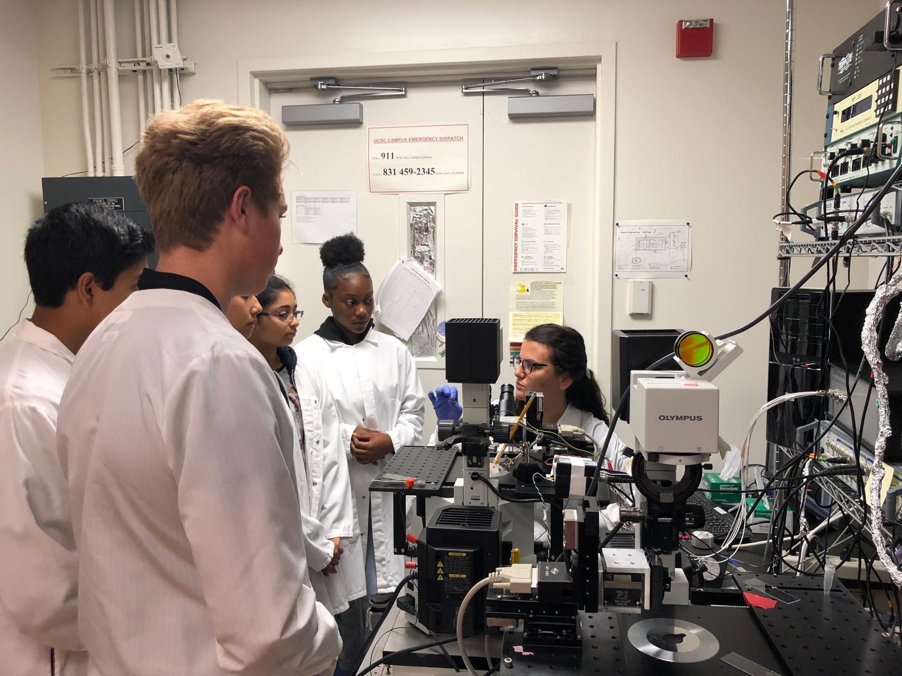

\

\

\

O Programa Acadêmico de Estágio e Intercâmbio (PAEI) foi desenhado para contemplar falantes de Português com pesquisa científica em instituição de língua portuguesa em parceria com instituições do exterior. O PAEI é inspirado no [Science Internship Program](https://sip.ucsc.edu/about/) (SIP) da Universidade da Califórnia Santa Cruz ([UCSC](https://www.ucsc.edu)), onde o idealizador atua há pelo menos 8 anos. Para informações sobre as iniciativas   [DNA Brasil](https://dnabrasil.dev.br), [ReComBio Brasil](https://crest.ucsc.edu/r-and-research-in-computational-biology-recombio/) e o idealizador, visite os *links* indicados, assim como o [site acadêmico do Gepoliano Chaves](https://chaves-academic.netlify.app). 

\

\

\

{width=60% style="display: block; margin: 0 auto"}

\

\

\

A UCSC é conhecida por ferramentas como o *UCSC Genome Browser*, desenvolvido como aplicação da biologia computacional resultante da participação da instituição na publicação da primeira sequência de referência do genoma humano.

\

\

\

{width=60% style="display: block; margin: 0 auto"}

\

\

\

O PAEI oferece ao estudante de ensino médio (ou recém egresso), contato com pesquisador profissional. O interno aprende sobre as áreas de pesquisa acadêmica da instituição parceira, como a genômica na UCSC. A interação estudante-mentor contribui para desenvolver a pesquisa do mentor.

\

\

\

{width=60% style="display: block; margin: 0 auto"}

\

\

No PAEI, buscamos valorizar a experiência do professor da educação básica, desenvolvendo estratégias para melhoria do desempenho e aprendizagem, estimulando interesse em educação, ciência e tecnologia em alunos brasileiros. Jovens pesquisadores são expostos a linguagens de programação e receberem instrução para escrita e apresentação científicas. O acompanhamento é feito [pesquisa na modalidade à distância](https://paei.netlify.app/pmd).

\

\

\

\

\

\

\

\

\

\

\

\

