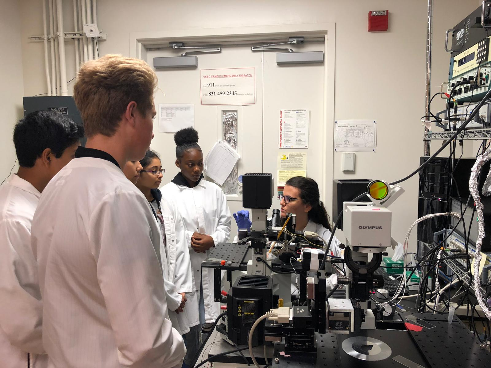
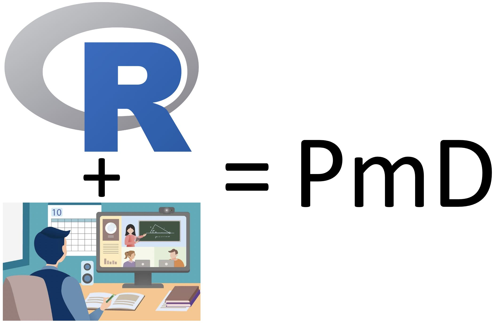
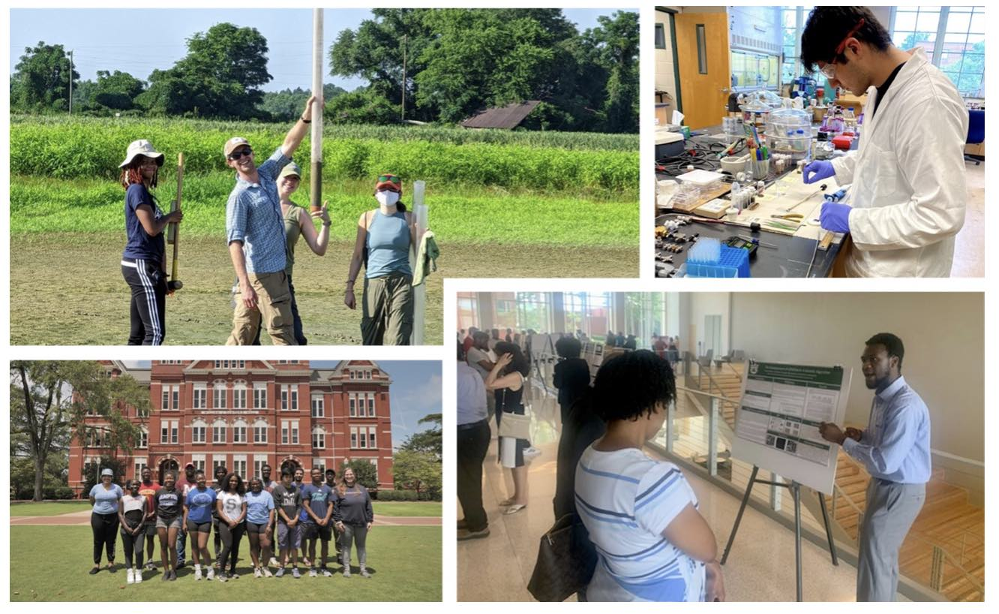

\

\

\

O Programa Acadêmico de Estágio e Intercâmbio (PAEI) foi desenhado para contemplar falantes de Português com pesquisa científica em instituição de língua portuguesa em parceria com instituições do exterior. O PAEI é inspirado no [Science Internship Program](https://sip.ucsc.edu/about/) (SIP) da Universidade da Califórnia Santa Cruz ([UCSC](https://www.ucsc.edu)), onde o idealizador atua há pelo menos 8 anos. Para informações sobre as iniciativas   [DNA Brasil](https://dnabrasil.dev.br), [ReComBio Brasil](https://crest.ucsc.edu/r-and-research-in-computational-biology-recombio/) e o idealizador, visite os *links* indicados, assim como o [site acadêmico do Gepoliano Chaves](https://chaves-academic.netlify.app). 

\

\

\

{width=60% style="display: block; margin: 0 auto"}

\

\

\

A UCSC é conhecida por ferramentas como o *UCSC Genome Browser*, desenvolvido como aplicação da biologia computacional resultante da participação da instituição na publicação da primeira sequência de referência do genoma humano.

\

\

\

{width=60% style="display: block; margin: 0 auto"}

\

\

\

O PAEI oferece ao estudante de ensino médio (ou recém egresso), contato com pesquisador profissional. O interno aprende sobre as áreas de pesquisa acadêmica da instituição parceira, como a genômica na UCSC. A interação estudante-mentor contribui para desenvolver a pesquisa do mentor.

\

\

\

{width=60% style="display: block; margin: 0 auto"}

\

\

No PAEI, buscamos valorizar a experiência do professor da educação básica, desenvolvendo estratégias para melhoria do desempenho e aprendizagem, estimulando interesse em educação, ciência e tecnologia em alunos brasileiros por meio da [pesquisa na modalidade à distância](https://paei.netlify.app/pmd).

\

### O que é PmD

\

\

O *Science Internship Program* (SIP), trabalha a profissionalização acadêmica permitindo o contato de jovens com ciência e pesquisa. Baseado na atuação do Dr. Gepoliano Chaves no SIP, o PAEI disponibiliza a [pesquisa real na modalidade à distância](https://www.youtube.com/watch?v=Z0WTzVNB2g4) para a Educação, Ciência e Tecnologia brasileiras. A pesquisa real na modalidade à distância (PmD) visa contribuir para o avanço científico na fronteira do conhecimento.

\

\

\

{width=70% style="display: block; margin: 0 auto"}

\

\

\

Diferente da pesquisa real regular acadêmica, a PmD apresentada pelo PAEI não necessita contato presencial e físico entre os participantes, pois os experimentos científicos são fundamentados nas linguagens de programação computacional, como R, Bash e Python. Participantes do PAEI são expostos à PmD por meio das Experiências de Pesquisa para Estudantes (EPEs) detalhadas abaixo.

\

\

### Experiências de Pesquisa para Estudantes (EPEs)

\

\

As experiências de pesquisa para estudantes permitem exploração acadêmica e profissional que desenvolvem vivência de carreiras, pesquisa e ciência para jovens estudantes. Embora muitas EPEs ocorram de forma física e presencial, outras, devido à natureza essecialmente computacional, como a bioinformática e a genômica, podem ser executadas de formas totalmente remotas e *on-line*.

\

\

{width=70% style="display: block; margin: 0 auto"}

\

\

Exemplos de EPEs desenvolvidas na Universidade da Califórnia Santa Cruz são apresentadas a seguir.

\

\

##### *Science Internship Program* (SIP)

Oferece a alunos motivados e avançados, a oportunidade única de trabalhar e aprender em instituição de pesquisa de primeira linha.
  
\

\

##### *Treehouse Undergraduate Bioinformatics Internship* (TUBI)

Imersão em bioinformática do *Treehouse Project*, no Instituto de Genômica da UCSC, que promove desenvolvido de pesquisa computacional aplicada à genômica. Busca contribuir para o progresso e uso da genômica no tratamento de cânceres pediátricos.

\

\

##### *Bioinformatics Bridge Course* (BBC): Curso Ponte de Bioinformática

O [BBC](https://bioinformatics-bridge-course.netlify.app) visa ser uma "ponte" para diversas limitações de ordem histórica e social para acesso igualitário à ciência e tecnologia genômica.

\

\

### PmD no Brasil

\

Esta modalidade de pesquisa foi implementada pela primeira vez pela [Diretoria de Educação à Distância](https://www.youtube.com/watch?v=5mjVZ_oLczo&t=2s) (DED) da Coordenação de Aperfeiçoamento de Pessoal de Nível Superior (CAPES), visando democratizar o acesso à educação, pesquisa e ciência para o interior do país por meio da Universidade Aberta do Brasil (UAB).

A participação do Núcleo de Ex-Bolsistas Brasileiros no Exterior no Grupo de Trabalho Interinstitucional (GTI) entre CAPES e CNPq levou o Núcleo de Ex-Bolsistas a propor ações que agregassem ao trabalho das diretorias da CAPES na formação continuada de professores e alunos da educação básica. 

Assim, chegou-se à proposta de um programa que possibilitasse tal auxílio. Neste contexto, desenvolvemos a [minuta curta do programa](Nova-Minuta-Curta.pdf). A iniciativa de um programa de PmD em que ex-bolsistas e pesquisadores brasileiros radicados no exterior possam retribuir os investimentos do povo brasileiro em sua formação, contribuem com a expertise do pesquisador no exterior e a internacionalização da educação brasileira.

\

\

##### Programa Acadêmico de Estágio e Intercâmbio (PAEI)

\

No PAEI buscamos implementar a PmD em parceria com DED/CAPES e Universidade Aberta do Brasil, usando o caráter tecnológico e assíncrono da ciência genômica e das linguagens de programação computacional como exemplos. 

Para tanto, pesquisadores mentores, professores e profissioais ou estudantes da educação básica, assim como empreendedores, compartilham e desenvolvem ferramentas, artigos científicos, código-fonte e outros produtos de contribuição para a educação, CT&I brasileiras.

O compartilhamento e versionamento de código-fonte ocorrem usando o [GitHub](https://tinyurl.com/gitCorndel). O website e desenvolvimento de ferramentas relacionadas ao PAEI são promovidos usando o [GitHub no versionamento e compartilhamento de código-fonte](https://drive.google.com/file/d/1ouj3EQbKzh60pYNbqeOxHkJKJAa4BnwW/view?usp=sharing), assim como o [Lab PmD](lab-virtual.html).
  
\

\

##### Nota sobre obtenção de vistos americanos

\

Não nos responsabilizamos de qualquer maneira pela aplicação ou obtenção do visto americano para participação de estudantes. A obtenção do visto americano é de inteira responsabilidade do candidato.
\

\

\

\

\

\

\

\

\

\

